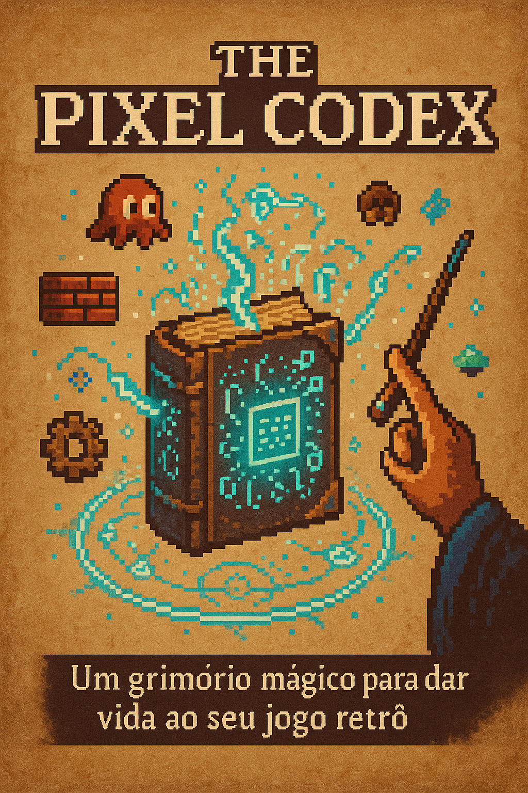

<h1><strong>Debugwarts Ebook</strong></h1>

<h2><strong>Descrição</strong></h2>
<p align="justify">
  Este projeto consiste na criação completa de um eBook temático sobre Pixel Art e desenvolvimento de jogos retrô, com estética mágica inspirada em Hogwarts e no universo do podcast Debugwarts.  
  O eBook foi desenvolvido utilizando ferramentas de IA generativa para criação de conteúdo, identidade visual e elementos gráficos, além de ferramentas de design para montagem final.  
  O objetivo foi aplicar na prática os fundamentos de IA generativa aprendidos no curso, produzindo um material coeso, criativo e visualmente profissional do zero.
</p>

<h2><strong>Tecnologias Utilizadas</strong></h2>
<ul>
  <li align="justify"><a href="https://chat.openai.com/" target="_blank"><strong>ChatGPT</strong></a>: Roteiro completo e estrutura textual do eBook.</li>
  <li align="justify"><a href="https://www.midjourney.com/" target="_blank"><strong>Midjourney</strong></a>: Criação da capa do eBook e fundo de pergaminho das páginas.</li>
  <li align="justify"><a href="https://www.canva.com/" target="_blank"><strong>Canva</strong></a>: Edição visual, diagramação e montagem final do eBook.</li>
</ul>

<h2><strong>Demonstração do Projeto</strong></h2>

<br/>
<a href="https://williandpg.github.io/debugwarts-ebook" target="_blank"><strong>Acesse e baixe o eBook aqui</strong></a>

<h2><strong>Estrutura do Projeto</strong></h2>
<p align="justify">A estrutura do projeto está organizada da seguinte forma:</p>

```plaintext
/
├── assets/
│   ├── cover-ebook.png
│   └── page.png
├── src/
│   └── prompts/
│       ├── chatgpt-script.md
│       ├── midjourney-page.md
│       └── midjourney-cover.md
├── output/
│   └── the-pixel-codex.pdf
│── index.html
│── style.css
└── README.md
```

<h2><strong>Notas</strong></h2> 
<ul> 
  <li align="justify">Utilizei o ChatGPT para criar todo o roteiro e estrutura textual do eBook.</li> 
  <li align="justify">Criei a capa e as páginas com estética de pergaminho usando Midjourney.</li> 
  <li align="justify">Montei e editei o eBook final no Canva, com diagramação personalizada.</li> 
  <li align="justify">Disponibilizei o eBook para leitura e download via GitHub Pages.</li> 
</ul> 

<h2><strong>Contato</strong></h2> 
<p><strong>Willian Gonçalves</strong> | 
  <a href="https://www.linkedin.com/in/williandpg/" target="_blank"><strong>LinkedIn</strong></a> | 
  <a href="https://github.com/williandpg" target="_blank"><strong>GitHub</strong></a> | 
  <a href="https://williandpg.github.io/" target="_blank"><strong>Portfólio</strong></a> | 
  <a href="mailto:goncalves.wdp@outlook.com" target="_blank"><strong>Email</strong></a> 
</p> 

<h2><strong>Créditos</strong></h2> 
<p align="justify"> Este projeto foi desenvolvido como parte do curso de Fundamentos de IA Generativa oferecido pela DIO, aplicando conceitos de IA, design visual e publicação digital para criar um eBook temático do zero. </p> 

<details> 
  <summary>**English Version**</summary> 

  <h1><strong>Debugwarts Ebook</strong></h1> 

  <h2><strong>Description</strong></h2> 
  <p align="justify"> 
    This project consists of the complete creation of a themed eBook about Pixel Art and retro game development, inspired by Hogwarts' magical aesthetic and the Debugwarts podcast universe. The eBook was built using generative AI tools for content creation and visuals, combined with design tools for final layout and publishing. The goal was to apply the knowledge from the Generative AI course to produce a cohesive, creative, and professional product from scratch. 
  </p> 

  <h2><strong>Technologies Used</strong></h2> 
  <ul> 
  <li align="justify"><a href="https://chat.openai.com/" target="_blank"><strong>ChatGPT</strong></a>: Full script and textual structure.</li> 
  <li align="justify"><a href="https://www.midjourney.com/" target="_blank"><strong>Midjourney</strong></a>: Cover and parchment backgrounds creation.</li> 
  <li align="justify"><a href="https://www.canva.com/" target="_blank"><strong>Canva</strong></a>: Layout, design, and final editing.</li> 
  </ul> 

  <h2><strong>Project Demonstration</strong></h2> 
   
  <br/> 
  <a href="https://williandpg.github.io/debugwarts-ebook" target="_blank"><strong>Access and download the eBook here</strong></a>

  <h2><strong>Project Structure</strong></h2> 
  <p align="justify">The project structure is organized as follows:</p>

```plaintext
/
├── assets/
│   ├── cover-ebook.png
│   └── page.png
├── src/
│   └── prompts/
│       ├── chatgpt-script.md
│       ├── midjourney-page.md
│       └── midjourney-cover.md
├── output/
│   └── the-pixel-codex.pdf
│── index.html
│── style.css
└── README.md
```

  <h2><strong>Notes</strong></h2> 
  <ul> 
    <li align="justify">Used ChatGPT to write the entire eBook structure and content.</li> 
    <li align="justify">Created the cover and page backgrounds with Midjourney.</li> 
    <li align="justify">Edited and designed the eBook in Canva with custom layout.</li> 
    <li align="justify">Published the eBook using GitHub Pages for easy access and download.</li> 
  </ul> 

  <h2><strong>Contact</strong></h2> 
  <p><strong>Willian Gonçalves</strong> | 
    <a href="https://www.linkedin.com/in/williandpg/" target="_blank"><strong>LinkedIn</strong></a> | 
    <a href="https://github.com/williandpg" target="_blank"><strong>GitHub</strong></a> | 
    <a href="https://williandpg.github.io/" target="_blank"><strong>Portfolio</strong></a> | 
    <a href="mailto:goncalves.wdp@outlook.com" target="_blank"><strong>Email</strong></a> 
  </p> 

  <h2><strong>Credits</strong></h2> 
  <p align="justify"> This project was developed as part of the Generative AI Fundamentals course by DIO, applying AI, visual design, and publishing concepts to create a themed eBook from scratch. </p> 
</details> 